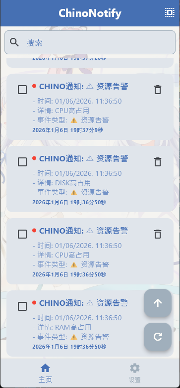
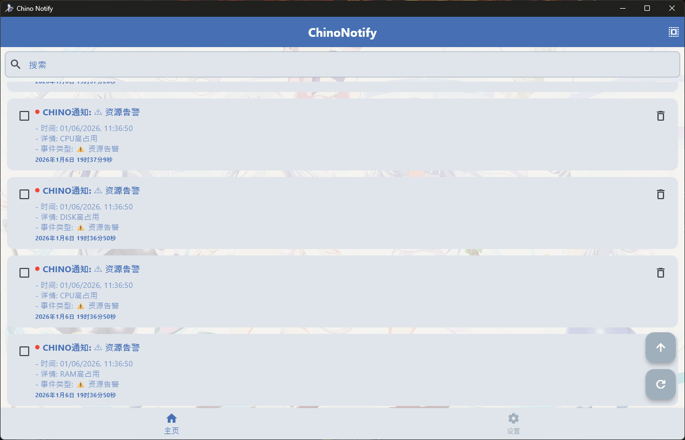
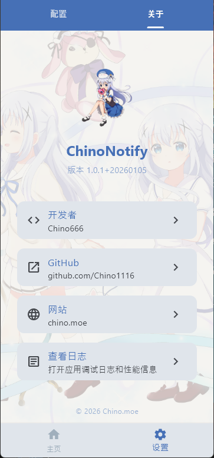
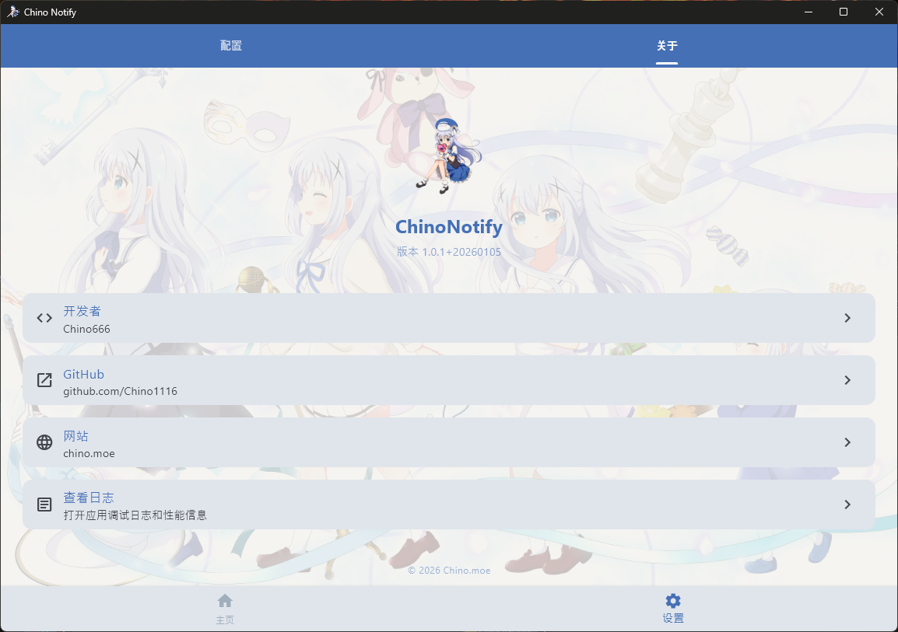

**English** | [简体中文](README.md) | [日本語](README_ja.md)

## Client Downloads

- [Android APK](client/ChinoNotify_android.apk)
- [iOS IPA](client/ChinoNotify_ios.ipa)
- [Windows x64 ZIP](client/ChinoNotify_windows_x64.zip)
- ### [All Platforms 123 Cloud Download](https://www.123865.com/s/Cbj7Vv-RPxuA)

# Disclaimer

0. Commercial use of this project is prohibited.<br>
1. The client is packaged but not open source, only downloads are provided.<br>
2. The server is open source and can be deployed by yourself.<br>
3. The software allows configuration of any server address.<br>
4. The software is completely free. If you like it, give it a STAR.<br>
5. This project is developed by AI. If you dislike this project for any reason, please leave.<br>
6. iOS installation requires self-signing the IPA, otherwise it cannot be used.<br>
7. iOS background push depends on Apple's official APNs service, which requires an Apple developer account that I can't afford.<br>
8. You can also develop your own client based on this very simple server.

[](https://github.com/Chino1116/chino_blog)

# <font color="#4671bb">ChinoNotify</font>

ChinoNotify is a cross-platform notification software that supports Android, iOS, and Windows clients. You can deploy the server yourself and configure the client to connect to any server.

## Client Capabilities

1. Batch delete notifications.
2. View notification details.
3. Full-text search notifications, and batch delete search results.
4. Multi-select to adjust message status (read/unread).
5. Pseudo-real-time synchronization of notification deletion/reading status across all platforms.
6. After saving configuration, you may need to click the refresh button to take effect (this isn't a capability, more due to my laziness).

## App Screenshots

<center class="half">


</center>
<center class="half">


</center>

## Perhaps some rambling below

> Q: <font color="#4671bb">Why did you want to make this?</font><br>A: Because most Webhook push software requires fees or has push volume limits, or platform restrictions, so ChinoNotify was born to meet my personal needs.<br><br>
> Q: <font color="#4671bb">Tech Stack</font><br>A: Server uses Python Flask + SQLite. Client uses Flutter for rapid development across all platforms. (Without a Mac, I used Github Action to repeatedly package and debug the iOS version for what felt like ten thousand years.)

# <font color="#4671bb">Deployment Tutorial</font>

## Server Deployment

### Prerequisites

Python 3.x is installed.

### 1. Install Dependencies

Enter the server folder and run the following command to install Python dependencies.

```bash
pip install -r requirements.txt
```

### 2. Run the Server

Enter the server folder and run the following command. The backend will run on <font color="#4671bb">localhost:5000</font>.

```bash
python run.py
```

### 3. Configure Client

In the client software, set the server address to your deployment address.

### Server deployment is now complete

## If you've read this far, you must be interested in this project, please give it a free Star!

### Star Trend

[](https://www.star-history.com/#Chino1116/chino_notify_public&type=date&legend=top-left)
